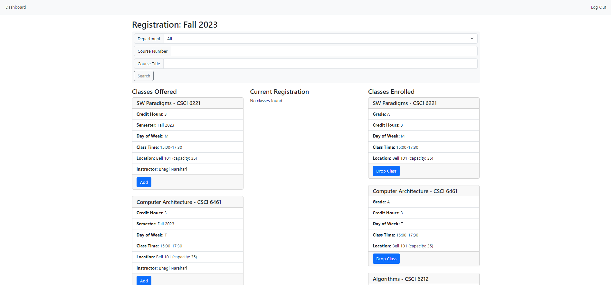

# ARG-08: Phase2
**Team:** Thomas Gillespie, Elaine Ly, Ozzy Simpson

## SQL Table Diagram
[](https://drawsql.app/teams/db-phase-2/diagrams/copy-of-schema-phase-2-team-8)

### Normal Forms
We believe that our databse is in 3NF. Each table has a primary key that uniquely identifies each row. There are no repeating groups within the tables. There are no transitive dependencies between non-primary key columns within each table. Our database is not in BCNF because in some of our tables (ex. user) we have multiple fields that could be candidate keys such as the username.

## Visual Overview
### ADS

Dashboard of student with an advising hold.


Advising form submission page.


Submitted Form1.


Students list with advising actions on each student.

### APPS
<!-- TODO -->

Applicant can create an account


Applicant home page


Application


The home page changes after submitting an application


The higherups can view and edit the application, marking matierials as received


Applicant can accept their offer 


### REGS

View of privileged user editing students' grades.


View of the course catalog page available to all users.


View of a student registering for classes.


View of schedule of classes for the registrar.

## Design Justification
To integrate our three systems, we first combined and simplified the databases for REGS and ADS since they had the most overlap. Then, we merged the APPS database into that combined database so that we could work off of singular database for the rest of our integration.

After creating the database, we focused on ensuring any updates we made to the database schema did not break any existing functionality from our phase 1 versions. We also focused on ensuring that our new database schema would be able to support all of the functionality we wanted to add in phase 2.

Once we had a working database, we focused on integrating the three systems together to create a seamless app. We utilized Flask Blueprints to help us organize our code and make it easier to integrate the three systems. Once all routes were accessible from the same app, we removed duplicate functionality (like login, create account, etc.). We also added a dashboard page that combined the functionality of the three systems into one page so that routes and functionality from the various systems were easily accessible.

Finally, we added missing functionality and fixed bugs from phase 1, while also adding additional functionality to the app, such as an alumni chat feature and confetti to the dashboard for when a student is admitted and commits to the university.

## Work Breakdown
- Elaine:
    - [x] Registrar styling/functionality: allowed registrar to add, search, and remove from schedule of classes 
    - [x] Enabled user to add birthday to account registration, enabled room and room capacity in database
    - [x] Changed permissions/dashboard to include registrar
    - [x] Integrate REGS into combined database: contributed faculty.html (grading feature), catalog.html (catalog of classes), registration.html (class registration)
    - [x] SQL diagram
- Thomas:
    - [x] Integrated APPS into combined database
    - [x] Fixed the apps routes to suit our designed choice of adding more py documents and folders
    - [x] Updated admin privliges regarding applicants
    - [x] Allow the applicant to choose which semester they are applying for
    - [x] Allow the applicant to upload their transcript to the DB, via file upload or choose a mail-in option
    - [x] integrated a "create account feature" that assumes applicants are creating an account
- Ozzy:
    - [x] Integrate ADS into combined database, app
    - [x] Create merged dashboard page
    - [x] (most) queries/reports
    - [x] Advising form/hold
    - [x] Styling for all pages to be consistent
    - [x] Helped with APPS updates
    - [x] Alumni chat
    - [x] Confetti!

## Special Features

### Alumni Chat
Every alumni has access to a group chatroom with all other alumni. Message history is preserved in the database so that alumni can see messages from before they graduated.

### Confetti
When a student is accepted and commits to the university, confetti will appear on their dashboard page.

### Advising form/hold
When an applicant is matriculated and becomes a student, they must lift their advising hold by filling out an advising form. Once that form is approved by their advisor (or a GS/sysadmin), they are eligible to register for classes, submit a Form1, and apply to graduate (if they meet basic eligibility criteria).

### Search features
Nearly every informational page has a search functionality to enable easier and friendlier user navigation.

### Registrar
The registrar is able to help the administration with assigning grades, viewing transcripts, and organizing the schedule of classes for the current semester. 

### Course capacity
Courses are assigned rooms and capacities so that students can only register for courses that have not reached their capacity. If a student tries to register for a course that has reached its enrollment capacity, they are not able to.

### `@login_required` decorator
Prior to defining a route, you can use the `@login_required` decorator to require that a user is logged in to access the route. If a user is not logged in, they will be redirected to the login page. Upon successful login, they will be redirected to the page they were trying to access.

To use this decorator, you can import it from `helpers.py`:
```python
from helpers import login_required
```

### `@authorized_user` decorator
Prior to defining a route, you can use the `@authorized_user` decorator to require that a user has the correct role to access the route. If a user does not have the correct role, they will be redirected to the 401 error page. The decorator takes in a list of roles that are allowed to access the route. For example, if you want to require that a user is either a student or a grad secretary, you would use `@authorized_user(['student', 'gs'])`.

If using this decorator with `@login_required`, it's recommended to use `@login_required` first.

To use this decorator, you can import it from `helpers.py`:
```python
from helpers import authorized_user
```
